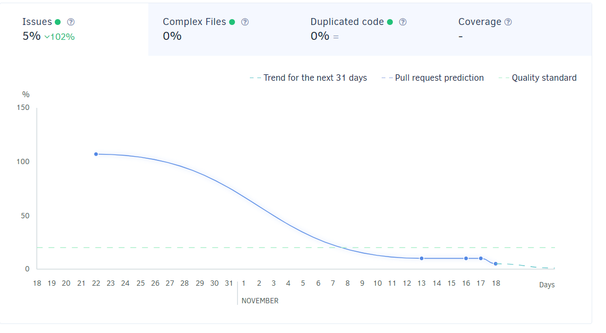

# Zaawansowane Języki Programowania
| Travis CI Status | Codacy |
|:----:|:----:|
|[](https://travis-ci.org/lzielezinska/advanced-programing-languages) | [](https://www.codacy.com/manual/lzielezinska/advanced-programing-languages?utm_source=github.com&amp;utm_medium=referral&amp;utm_content=lzielezinska/advanced-programing-languages&amp;utm_campaign=Badge_Grade)|

## Opis problemu
Napisany program jest zrefaktoryzowaną wersją programu: [GildedRose-Refactoring-Kata](https://github.com/emilybache/GildedRose-Refactoring-Kata/tree/master/python)
Korzystałam z refaktoryzacji terapeutycznej.


## Przebieg pracy
### Testy
Główną funkcjonalnością programu jest aktualizowanie wartości przedmiotów. Dlatego też testy powinny się skupić na sprawdzeniu tego zastosowania.
W pierwszej wersji projektu zastajemy klasę testową z jednym testem, którego celem jest sprawdzenie poprawności nazwy przedmiotu po wywołaniu metody update_quality().
```python
    def test_foo(self):
        items = [Item("foo", 0, 0)]
        gilded_rose = GildedRose(items)
        gilded_rose.update_quality()
        self.assertEquals("fixme", items[0].name)
```
Ponieważ update_quality() nie ma żadnego wpływu na nazwę przedmiotu, zamieniłam ją na 10 testów. Sprawdzają one czy wartość produktu zmienia się w prawidłowy sposób oraz czy metoda update nie nadaje przedmiotom wartości z poza zakresu od 0 do 50.

Do pisania testów użyłam pythonowej biblioteki do testów jednodtkowych  `unitest`

Wywołanie testów:
Testy należy wywołać z katalogu "GildedRose-Refactoring-Kata" za pomocą komendy
```
python3 test_gilded_rose -v
```
### Refaktoryzacja metody update_quality()

W pierwszej wersji programu cała funkcjonalność zmiany wartości przedmiotu została zawarta w metodzie `update_quality()`. Jak widać poniższy kod jest nieczytelny. Analizując tę metodę skorzystałam z metodyki code smells. Za jej pomocą można stwierdzić, że występuje tutaj szereg błędów takich jak:
1. Długa metoda (ang. Large method) -> Wszystkie porówananie i pętle konieczne do zaktualizowania wartości przedmiotu zostały zawarte w jednej funkcji. Najprostszym rozwiązaniem tego problemu, jest rozbijanie funkcjonalności na mniejsze metody.
2. Powielony kod (ang. Duplicated code) -> Roziwiązaniem jest sporządzenie metod pomocniczych, które zostaną wywołane w miejscach, gdzie kod został powtórzony.


```python
def update_quality(self):
    for item in self.items:
        if item.name != "Aged Brie" and item.name != "Backstage passes to a TAFKAL80ETC concert":
            if item.quality > 0:
                if item.name != "Sulfuras, Hand of Ragnaros":
                    item.quality = item.quality - 1
        else:
            if item.quality < 50:
                item.quality = item.quality + 1
                if item.name == "Backstage passes to a TAFKAL80ETC concert":
                    if item.sell_in < 11:
                        if item.quality < 50:
                            item.quality = item.quality + 1
                    if item.sell_in < 6:
                        if item.quality < 50:
                            item.quality = item.quality + 1
        if item.name != "Sulfuras, Hand of Ragnaros":
            item.sell_in = item.sell_in - 1
        if item.sell_in < 0:
            if item.name != "Aged Brie":
                if item.name != "Backstage passes to a TAFKAL80ETC concert":
                    if item.quality > 0:
                        if item.name != "Sulfuras, Hand of Ragnaros":
                            item.quality = item.quality - 1
                else:
                    item.quality = item.quality - item.quality
            else:
                if item.quality < 50:
                    item.quality = item.quality + 1
```
Poprawiona metoda `update_quality()` iteruje po tablicy, której elementami są obiekty klasy Item.
Jeżeli `item.quality` jest mniejsza od 0 lub większa od 50 metoda zgłasza wyjątek, jeżeli wartość `item.quality` quality jest prawidłowa zostaje wywołana metoda `update_quality_of_specialized_item`.
```python
def update_quality(self):
    for item in self.items:
        if item.quality < 0 or item.quality > 50:
            raise ValueError(item.name + str(item.quality) + "Item quality must be in a range beetween 0 and 50!")

        item.sell_in -= 1 
        self.update_quality_of_specialized_item(item)
```
Zadaniem metody `update_quality_of_specialized_item` jest rozpoznanie przedmiotu oraz wywołanie dedykowanej dla niego metody poprawijącej wartość konkretnego przedmiotu.
```python
    def update_quality_of_specialized_item(self, item):
        if item.name == "Backstage passes to a TAFKAL80ETC concert":
            self.update_quality_of_backstage_passes(item)
        elif item.name == "Aged Brie":
            self.update_quality_of_aged_bree(item)
        elif item.name == "Sulfuras, Hand of Ragnaros":
            self.update_quality_of_sulfurus(item)
        elif item.name == "Conjured Mana Cake":
            self.update_quality_of_conjured_item(item)
        else:
            self.update_quality_of_normal_item(item)
```
Dla każedego rodzaju przedmiotu stworzyłam odrębną funckję (nawet w przypadku gdy wykonywana jest dokładnie taka sama operacja).
Zapewnia to łatwość wprowadzania zamian oraz dodawania nowych obiektów o specjalnych właściwościach. To rozwiązanie umożliwia również dalszą refactoryzację polegającą na stworzeniu odrębnej klasy i przeniesieniu do niej metody update.
Przykład metody obsugującej "Conjured Mana Cake":

```python
def update_quality_of_conjured_item(self, item):
    if item.quality <= 2:
        item.quality == 0
    else:
        item.quality -= 2
```

Jak widać na powyższym przykładzie w każdej metodzie przed dokonaniem aktualizacji sprawdzam czy nie spowoduje ona nadaniu item.quality nieodpowiedniej wartości.

### Podsumowanie refactoryzacji


